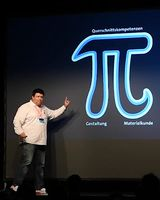
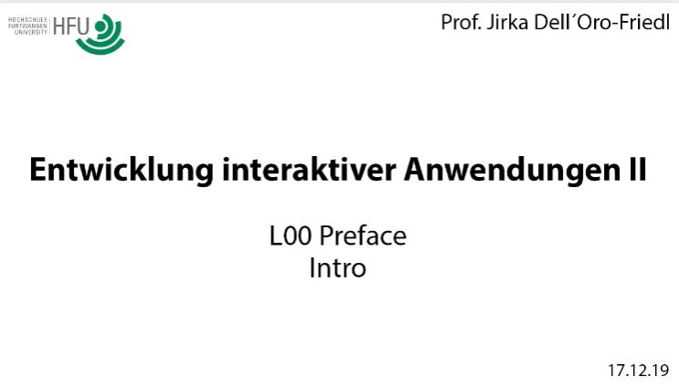

# L00_Preface  
> **Hinweise:** 
> - In den Texten dieser Lektionen wird das geschlechtergerechte Neutrum verwendet, siehe <https://jirkadelloro.github.io/Neutrum>
> - EIA2 war ein Modul für den Studiengang Medienkonzeption. Die Lehrvideos entstammen diesem Modul und werden für Code 1 und 2 wieder verwendet. Deswegen wird teilweise auf Strukturen wie "Workshop" verwiesen, die mittlerweile das Gesamtkonzept des Studiengangs Games & Immersive Media tragen.

## Motivation  
- [x] Klicke auf die Startsymbole und schaue dir die Videos an. Sie geben dir einen Einblick in die Möglichkeiten, die sich durch den Kurs für dich eröffnen werden, wenn Du aktiv mitarbeitest, und sie vermitteln dir, wie dringlich die Inhalte sind. Verlasse die Rolle des Konsumentis und werde zum Macheri! Du stehst am Scheideweg: wirst Du zu denen gehören, die Maschinen beherrschen, oder zu jenen, die Maschinen beherrschen? (kleines Kōan zum Meditieren)

<!--

<a href="https://www.youtube.com/watch?v=y-t8SWdogGo&t=1439s"> Digital Designer | Dr. Marcus Trapp | UX-DAY KONFERENZ 2018</a>    

Wenn Du Digital Designer werden willst, wenn Du das wirklich richtig machen willst, musst Du sowohl diese Gestaltungskompetenz mitbringen, als auch diese Materialkunde. Und in unserem Fall ist das Material eben halt digital. "Kenne ich die Methoden? Kenne ich die Tools? Weiß ich was das bedeutet? Kenne ich die Technologien?"

  
-->

<a href="https://youtu.be/-jRREn6ifEQ"> The poetry of programming | Linda Liukas | TEDxCERN</a>    

When I was a girl, I wanted to be a storyteller. I loved make-believe worlds and my favorite thing to do was to wake up in the mornings in Moominvalley, in afternoons I would roam around the Tatooines, and in the evenings I would go to sleep in Narnia. And programming turned out to be the perfect profession for me. I still create worlds. Instead of stories, I create them with code. Programming gives me this amazing power to build my whole little universe with its own rules and paradigms and practices. Create something out of nothing with the pure power of logic. And that probably makes me into a poet. 

  

<a href="../X01_Appendix/Crawford/Crawford.html"> Algorithms and Art | Chris Crawford</a>    

Good artists have never been intimidated by some technology. They figure a technology is a tool to express myself with. They roll up their sleeves, they get their hands dirty and they use the tool to get the job done! Wether it's a welding torch, the intestines of a cat, oil paint, whatever. You use the technology to get the job done. And the computer is far and away the most expressive and the most powerful medium of expression that we ever had, and if you want to use it, you've got to speak its language... sorry.

  

<a href="https://www.youtube.com/watch?v=MvTSPwftvyo"> Learning to Code is Not Just for Coders| Ali Partovi | TEDxSausalito</a>   

Learning how to write isn't just for people who grow up to become writers, math isn't just for mathematicians. Every public school teaches these topics because they're foundational for other pursuits. Once you know how to read and write, you use those skills to learn new ideas and more importantly, to create your own ideas and to share them. Computer science isn't simply about learning how to code. Learning how to code is a start. Once you know the language, that's when your imagination takes over. That's when you can begin to take on complex problems and to create new things.

  

<!--
## Überblick 

  
   
<a href="http://hdl.handle.net/10900.3/OER_XDVTECCQ"> L00 Preface: Intro</a>

-->

## Rückblick
Im Modul "Theory 1" hattest Du bereits fundamentale Prinzipien der Informatik und der Programmierung kennen gelernt. Du hast eine Vorstellung davon, wie ein Computer funktioniert und wie Daten kodiert und verknüpft werden. Auch hast Du dich bereits mit Algorithmen beschäftigt und Abläufe in Form von Diagrammen konzipiert. Das alles sind wichtige Grundlagen, auf denen das Modul "Code 1" aufbaut.

Im Modul "Code 1" wurdest Du nun schon etwas an die praktische Anwendung heran geführt. Du hast verstanden, was ein Versionscontrollsystem wie GIT ist, warum es sinnvoll und wichtig für deine zukünftige Arbeit ist und wie Du damit umgehst. Weiterhin hast Du HTML und CSS kennen gelernt und damit experimentiert. Diese Web-Technologien stellen die Grundlage für die weiteren Schritte dar. Denn als technische Plattform dienen in "Code 1" und "Code 2" Internetbrowser, da sie auf allen gängigen Geräten zur Verfügung stehen. In diesem Zusammenhang hast Du auch schon die interne Repräsentation der Daten im "Document Object Model" (DOM) untersucht und dieses direkt manipuliert.

Darüber hinaus hast Du bereits TypeScript und ein paar grundlegende Anweisungen kennen gelernt. Im Vergleich zu JavaScript, werden die verwendeten Datenstrukturen sichtbar und Du erhältst eine automatische und umfassende Hilfestellung bei der Implementation deines Codes. Auch erste Interaktionen konntest Du mit Hilfe der Ereignissteuerung umsetzen. Hierzu hast Du ein gutes Verständnis der DOM-Klassenhierarchie und des Laufzeitverhaltens erlangt.

### Einblick
Es ist erforderlich, dass die oben genannten Inhalte verinnerlicht sind und angewendet werden können, insbesondere
- Die Arbeit mit Github und Visual Studio Code
- Die Informationsrepräsentation im binären und hexadezimalen System
- Die grundlegenden in JavaScript und TypeScript verwendeten Datentypen
- Einfache und assoziative Arrays
- Die Sprachkonstrukte imperativer Programmiersprachen: Anweisungen, Operatoren, Kontrollstrukturen, Funktionen
- Generierung dynamischer Webseiten
- DOM-Klassen- und Laufzeit-Hierarchie
- Problemlösungsstrategie
- Die Arbeit mit der Browserkonsole und Debugging im Browser

## Ausblick
In "Code 1" lernst Du nun, auch komplizierte Aufgabenstellungen anzugehen. Dabei steht eine planvolle Vorgehensweise im Fokus. Eine gute Konzeption ist erforderlich, bevor es an die Umsetzung dieser per Code geht. Hierzu wirst Du Diagrammformen der "Unified Modelling Language" (UML) verwenden, um mit deren Hilfe Probleme zu durchdringen und Lösungen zu konzipieren. Ihre nachfolgenden Implementationen mit TypeScript stellen lediglich Nachweise der erfolgreichen Konzeption dar. Ohne ein Konzept ist es müßig mit dem Coden zu beginnen...

Das folgende Aktivitätsdiagramm zeigt schon den Vorgang der Konzeption.   
[Activity Diagram - Konzeption](../X01_Appendix/UML/AD_Konzeption.svg)  

- [x] Untersuche das Diagramm. Kannst Du schon nachvollziehen, was es vermittelt? Alle Symbole sind genormt und haben besondere Bedeutung, grobe Zusammenhänge erschließen sich aber vielleicht schon intuitiv. In diesem Kurs geht es auch darum dich in die Lage zu versetzen, solche Diagramme korrekt und sinnvoll selbst zu zeichnen.

## Sektionen
### Sektion 1
besteht aus den Lektionen 01 bis 03 und behandelt tiefergehend die Arbeit mit HTML-Elementen und dem DOM, um komplexere und vor allem dynamische interaktive Anwendungen auf dieser Basis planen und entwickeln zu können. Außerdem werden die interaktiven Formularelemente des HTML-Standards eingesetzt und ausgewertet.  

### Sektion 2
besteht aus den Lektionen 04 bis 06 und behandelt die Verteilung einer Anwendung auf Client-Server-Datenbank-Systeme, so dass Du moderne Anwendungen konzipieren kannst, welche Informationen im Internet dynamisch verarbeiten und verwalten und den Nutzern zur Interaktion bereit stellen. Die Komplexität liegt hier weniger in den Algorithmen als in der Vielzahl der Systeme und der Kommunikation zwischen ihnen. Lektion 07 ist in Lektion 06 aufgegangen.

### Sektion 3
besteht lediglich aus der Lektion 08 und etabliert den Canvas als neue Grundlage für die visuelle Darstellung der Ergebnisse eines Programms. Hier werden nun nicht mehr mit vorgefertigten Strukturen genutzt, sondern es kann pixelgenau und beliebig auf einer Fläche gezeichnet werden. Damit sind die Grenzen des Box-Models und des DOMs gesprengt und die volle Gestaltungsfreiheit wird erlangt. 

### Sektion 4
besteht aus den Lektionen 09 bis 11 und behandelt die Frage, was überhaupt diese "Objekte" sind, mit denen die ganze Zeit gearbeitet wurde, wie man solche selbst erstellt und was man damit noch machen kann. Hier öffnet sich ein intuitiver Zugang zur Entwicklung interaktiver Anwendungen, der unabhängig von Betriebssystemen, Plattformen und dergleichen ist. Mit den erlangten Kenntnissen lassen sich nicht nur klassische Websites, sondern Anwendungen in völlig anderen Bereichen planen und entwickeln, von der nativen Smartphone-App bis zu voll ausgereiften Konsolengames.

